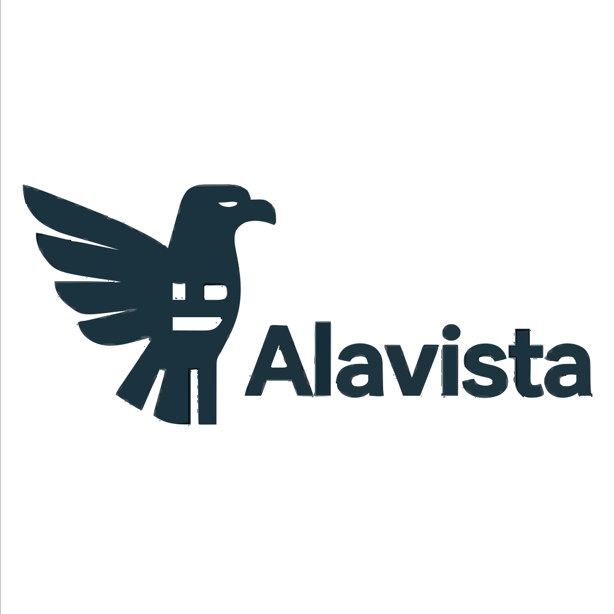

<table border="0">
  <tr>
    <td></td>
    <td><h1>Alavista</h1></td>
  </tr>
</table>

**Alavista** is an open-source investigative analysis engine designed to help people cut through noise, scale, and obfuscation.
Its purpose is simple: **reveal what’s already there, hidden in plain sight.**

Built for journalists, researchers, analysts, and technically curious citizens, Alavista turns large, messy document collections into a structured, searchable, and explainable knowledge space. It does this without speculation, prediction, or hallucination. Everything is grounded in the literal text of the documents — surfaced, organized, and made navigable.

## Why Alavista Exists

Modern corruption thrives on volume and opacity. Thousands of pages of filings, emails, logs, flight records, FOIA dumps, and scanned documents act as a smokescreen. The information is “public,” but practically inaccessible.

Alavista exists to close that gap.

It brings together semantic search, entity extraction, typed graphs, and persona-driven analysis into one coherent system that can be run locally, offline, and under your control.

## What Alavista Does

- **Semantic Search (Hybrid BM25 + Vector)**
  Query a corpus and get high-signal, precise results. No black box. No cloud required.

- **Typed Entity Graph**
  Build a structured map of people, organizations, documents, places, and events — with provenance for every edge.

- **Graph-Guided Retrieval (Graph-RAG)**
  Combine structure + semantics to follow trails, detect connection points, and answer complex questions.

- **Personas for Expert Lenses**
  Define investigative personas (Financial Forensics, Flight Analysis, Legal Patterns, etc.) that guide the system’s reasoning and tool selection.

- **Incremental Ingestion**
  Add URLs, files, PDFs, notes, or entire tranches of documents. Alavista embeds and indexes them automatically.

- **Local MCP + HTTP API**
  Use it with ChatGPT/Claude Desktop, custom agents, or a React UI — all running from your own machine.

## Philosophy

Alavista is grounded in a few principles:

- **Truth is discoverable.**
  Not predicted. Not inferred. Discovered — by systematically analyzing what’s actually there.

- **Transparency beats speculation.**
  Every relationship in the graph is a literal extractable statement with provenance.

- **Local-first.**
  Your data stays with you. Your machine, your index, your analysis.

- **Extendable.**
  Add personas, extraction rules, ingestion pipelines, or frontends. The modular architecture makes it possible.

## Who It’s For

- Investigative journalists
- FOIA warriors and watchdog groups
- Researchers and academics
- Concerned citizens
- Anyone who wants to understand large, dense, nonlinear document sets

You don’t need to be an ML engineer to use Alavista. If you can run a Docker Compose file or a local Python stack, you can use it.

## Roadmap (Aspirational Highlights)

- v1.0: baseline semantic search, ingestion pipeline, typed graphs, personas, MCP, and API.
- v1.x: richer ontology, temporal reasoning, automatic extraction pipelines, advanced graph queries.
- Future: multimodal ingestion (images → text summaries), collaboration tools, and domain-specific persona packs.

## What “A la vista” Means

**Alavista** comes from the Spanish phrase *a la vista* — “in plain sight.”
The tool exists to bring clarity to places where volume and complexity create fog.
What bad actors bury in documents, you can surface in minutes.

## Status

This repo is under active development.
Expect rapid evolution, some rough edges, and a growing set of tools to help uncover the truth.

If you want to contribute, test, or build on Alavista, you’re in the right place.